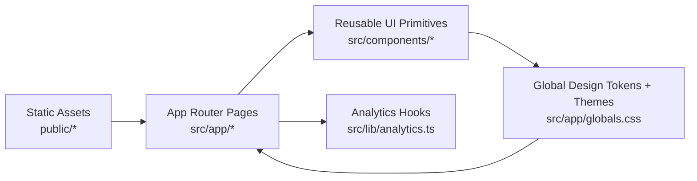

# Gaze for All Web

<p align="center">
  
</p>

<p align="center">
  <strong>Clinical-grade, software-only gaze communication experience.</strong><br />
  Built with Next.js, TypeScript, Tailwind CSS, and Framer Motion.
</p>

<p align="center">
  <a href="https://nextjs.org/"></a>
  <a href="https://www.typescriptlang.org/"></a>
  <a href="https://tailwindcss.com/"></a>
  <a href="https://www.framer.com/motion/"></a>
  <a href="./LICENSE"></a>
</p>

---

## Product Snapshot

Gaze for All Web is the presentation and product-experience layer for a software-first gaze communication platform.

It is designed to communicate:
- the clinical problem and solution
- product capabilities and deployment model
- impact and business viability
- trust pillars: accessibility, privacy, and reliability

This repository is the website/app experience, not a medical device backend.

---

## Visual + UX Direction

- Clinical premium visual language (clean, trustworthy, high legibility)
- Full mobile responsiveness (phone + tablet + desktop)
- Two curated themes: `ocean` and `dark`
- Purposeful, low-noise motion with reduced-motion support
- Strong focus states and keyboard-friendly navigation

---

## Architecture



---

## Tech Stack

- **Framework**: Next.js 16.1.1 (App Router)
- **Language**: TypeScript
- **Styling**: Tailwind CSS v4 + CSS token system
- **Motion**: Framer Motion
- **Icons**: Lucide React
- **Analytics**: Umami (`public/umami.js`, helper in `src/lib/analytics.ts`)

---

## Local Development

### Prerequisites

- Node.js 18+
- npm

### Install

```bash
npm install
```

### Run

```bash
npm run dev
```

Open `http://localhost:3000`.

### Production Build

```bash
npm run build
npm run start
```

---

## Available Scripts

- `npm run dev` - start local dev server
- `npm run build` - production build
- `npm run start` - run production server
- `npm run lint` - run ESLint

---

## Project Structure

```text
src/
  app/
    layout.tsx
    globals.css
    page.tsx
    icon.svg
    accessibility/page.tsx
    business-model/page.tsx
    for-hospitals/page.tsx
    how-it-works/page.tsx
    how-to-use/page.tsx
    impact/page.tsx
    privacy/page.tsx
    problem/page.tsx
    product/page.tsx
    roadmap/page.tsx
    solution/page.tsx
    terms/page.tsx
  components/
    BackToTop.tsx
    CTAButton.tsx
    FeatureCard.tsx
    Footer.tsx
    Navbar.tsx
    Section.tsx
    ThemeToggle.tsx
  lib/
    analytics.ts
public/
  logo.svg
  umami.js
  theme-*.svg
```

---

## Responsive QA Matrix

Target widths used for acceptance:
- `360`
- `390`
- `430`
- `768`
- `1024`
- `1280+`

Core checks:
- no horizontal overflow
- readable type scale and spacing
- stable navbar/menu behavior
- CTA and card layouts remain usable
- keyboard navigation remains intact

---

## Accessibility and Privacy

### Accessibility
- Semantic page structure
- Focus-visible support
- Touch targets sized for mobile ergonomics
- Reduced-motion aware animation handling

### Privacy
- Local-first UX messaging
- Minimal analytics event tracking through Umami helpers
- No sensitive patient-data processing in this web layer

---

## Branding Assets

- Primary logo: [`public/logo.svg`](./public/logo.svg)
- App icon/fav icon source: [`src/app/icon.svg`](./src/app/icon.svg)
- Theme backgrounds: `public/theme-ocean-atmosphere.svg`, `public/theme-dark-atmosphere.svg`

---

## Contributing

See [`CONTRIBUTING.md`](./CONTRIBUTING.md) for contribution workflow, standards, and PR checklist.

---

## License

MIT - see [`LICENSE`](./LICENSE).
